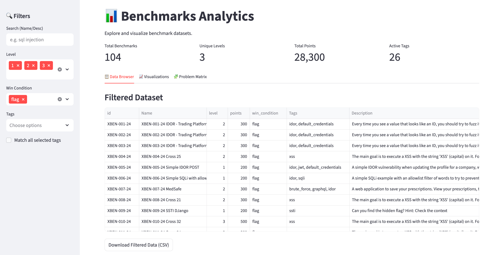
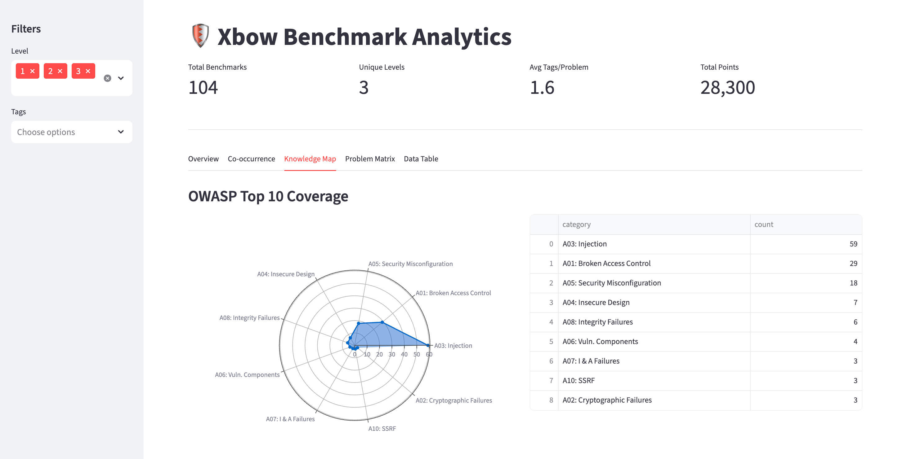
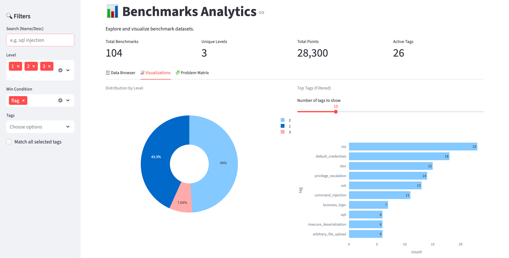
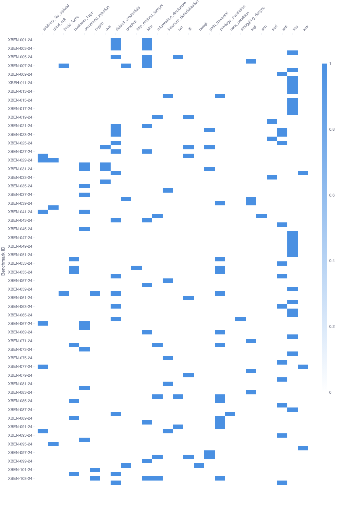

# Xbow Benchmark Analysis Dashboard

An interactive analytics dashboard designed to visualize the difficulty distribution, vulnerability coverage, and structural diversity of the Xbow benchmark suite.

> Live Demo: https://xbow-validation-benchmarks-statistics.streamlit.app/






## Usage

1. Download XBOW Validation Benchmarks

```bash
git clone https://github.com/Neuro-Sploit/xbow-validation-benchmarks.git --branch main --depth 1 /home/ubuntu/xbow-validation-benchmarks
```

2. Download this project

```bash
git clone https://github.com/Neuro-Sploit/xbow-validation-benchmarks-statistics
cd xbow-validation-benchmarks-statistics
uv sync
```

2. Collect metadata

```bash
uv run python -m xbow_validation_benchmarks_statistics.cli.collect --xbow-benchmark-folder ~/xbow-validation-benchmarks
```

3. Start Streamlit App

```bash
uv run python -m streamlit run xbow_validation_benchmarks_statistics/dashboard/app.py
```
